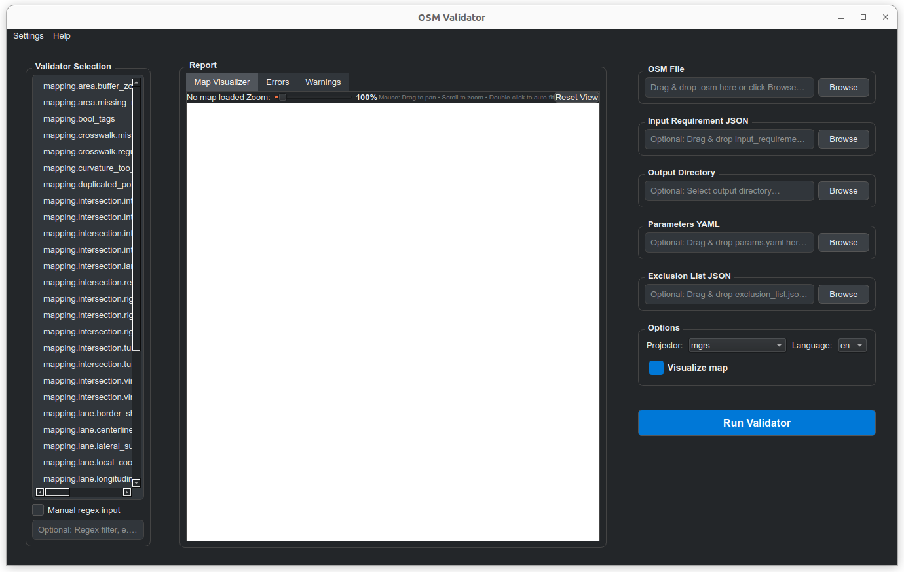

# autoware_lanelet2_map_validator

🇬🇧 **English ver** | 🇯🇵 [日本語 ver](./README_ja.md)

**This package was formerly one of the packages of `autoware_tools` have been moved here as a new repository (Jan, 2025)!! Commits before Feb, 2025 were made there.**

`autoware_lanelet2_map_validator` is a tool to validate Lanelet2 maps to ensure that Autoware can work properly with it.

The official Autoware requirements for Lanelet2 maps are described in [Vector Map creation requirement specifications (in Autoware Documentation)](https://autowarefoundation.github.io/autoware-documentation/main/design/autoware-architecture/map/map-requirements/vector-map-requirements-overview/) and [Pilot-Auto reference design](https://docs.pilot.auto/en/reference-design/common/map-requirements/vector-map-requirements/overview) (They are slightly different!!).

## Index

- [Design concept](#design-concept)
- [Installation](#installation)
- [How to use](#how-to-use)
  - [Validation using a requirement set](#usage-a-validation-using-a-requirement-set-a-list-of-validators)
  - [Validation with with specific validators](#usage-b-validation-with-specific-validators)
  - [Validation using GUI application](#usage-c-validation-using-gui-application)
  - [Advanced usages](#advanced-usages)
  - [Available command options](#available-command-options)
- [Inputs and outputs](#inputs-and-outputs)
  - [Requirement set (Input JSON file, recommended)](#requirement-set-input-json-file-recommended)
  - [Validation results (Output JSON file)](#validation-results-output-json-file)
  - [Exclusion list (Input JSON file, optional)](#exclusion-list-input-json-file-optional)
  - [Validation signature](#validation-signature)
- [How to add a new validator (Contributing)](#how-to-add-a-new-validator)
- [Relationship between requirements and validators](#relationship-between-requirements-and-validators)

## Design concept

The `autoware_lanelet2_map_validator` is designed to validate `.osm` map files by using and extending the [lanelet2_validation](https://github.com/fzi-forschungszentrum-informatik/Lanelet2/tree/master/lanelet2_validation) package for Autoware.

`autoware_lanelet2_map_validator` takes the lanelet2 map (`.osm` file) and requirement set (`.json` file) as the input, and output validation results (`.json`) to the console.

If a requirement set is given, `autoware_lanelet2_map_validator` also outputs validation results reflecting the input requirement set.


## Installation

**Currently `autoware_lanelet2_map_validator` requires an [Autoware](https://github.com/autowarefoundation/autoware) workspace and build `autoware_lanelet2_map_validator` within there.**
We will be working on an installation process that doesn't need Autoware installation in the future.

### 0. Prerequisites

Confirm you have the following environments

- OS
  - Ubuntu 22.04
- ROS
  - ROS 2 Humble
- Git

### 1. Clone Autoware (if you don't have an Autoware environment)

Launch your terminal, then clone and import Autoware source codes with the following commands.

```bash
git clone https://github.com/autowarefoundation/autoware.git
cd autoware
mkdir src
vcs import src < autoware.repos
```

### 2. Clone autoware_lanelet2_map_validator

`autoware_lanelet2_map_validator` should be somewhere in the `autoware/src` directory.
If you don't mind your folder structure, the following will be fine.
You can skip `git checkout` if there is no specific version needed.

```bash
# Assuming you are at the `autoware` directory
cd src
git clone https://github.com/tier4/autoware_lanelet2_map_validator.git
git checkout <VERSION>  # 1.0.0 for example
cd ..  # go back to the `autoware` directory
```

### 3. Install dependent packages

You need to install packages required from `Autoware`.

```bash
# Assuming you are at the `autoware` directory
source /opt/ros/humble/setup.bash
sudo apt update && sudo apt upgrade
rosdep update
rosdep install -y --from-paths src --ignore-src --rosdistro $ROS_DISTRO
```

### 4. Build autoware_lanelet2_map_validator

Build autoware_lanelet2_map_validator with the following command. This doesn't build the entire Autoware so it is much quicker.

```bash
colcon build --symlink-install --cmake-args -DCMAKE_BUILD_TYPE=Release --packages-up-to autoware_lanelet2_map_validator
```

## How to use

There are two ways to run `autoware_lanelet2_map_validator`: run with a requirement set, or run against specific validators.
The most general usage is to run with the requirement set.

### Usage-A: Validation using a requirement set (a list of validators)

You can run `autoware_lanelet2_map_validator` with the following command.

```bash
# Assuming you are at the `autoware` directory
source install/setup.bash

ros2 run autoware_lanelet2_map_validator autoware_lanelet2_map_validator \
--projector mgrs \ # or -p in short
--map_file <absolute_or/relative_path/to_your/lanelet2_map.osm> \ # or -m in short
--input_requirements <absolute_or/_relative_path/to_your/requirement_set.json> \ # or -i in short
--output_directory <directory/where_you/want_to/save_results> \ # or -o in short
```

For example, if ...

- Your map is made with the MGRS projection
- Your map is saved as `$HOME/autoware_map/area1/lanelet2_map.osm`
- Chosen `autoware_requirement_set.json` as your requirement set
- Chosen the current directory to output the validation result (`lanelet2_validation_results.json`).

the command will be like

```bash
# Assuming you are at the `autoware` directory
source install/setup.bash

ros2 run autoware_lanelet2_map_validator autoware_lanelet2_map_validator \
-p mgrs \
-m $HOME/autoware_map/area1/lanelet2_map.osm \
-i ./install/autoware_lanelet2_map_validator/share/autoware_lanelet2_map_validator/map_requirements/autoware_requirement_set.json
-o ./
```

Then you will see `lanelet2_validation_results.json` in your current working directory. See [Inputs and outputs](#inputs-and-outputs) for more information of the input requirements and the output result (`lanelet2_validation_results.json`).

**Be aware that...**

- Choose your input requirement set from the `autoware_lanelet2_map_validator/map_requirements` directory that suits your purpose the most.
  - `autoware_requirement_set.json` is the most general file for Autoware if you don't have any specifications.
- `lanelet2_validation_results.json` will be overwritten if it already exists!!
- The following tab will be appended to the lanelet2 map (`.osm` file). This tab shouldn't harm the Autoware behaviour.
  - All information will be generated automatically. The `validator_version` is obtained from the `package.xml` and the `requirements_version` is obtained from the requirement set JSON file.

  ```xml
  <validation name="autoware_lanelet2_map_validator" validator_version="1.0.0" requirements="autoware_requirement_set.json" requirements_version="0.0.0" />
  ```

### Usage-B: Validation with specific validators

`autoware_lanelet2_map_validator` consists of multiple small validators in order to realize complex requirements with a combination of them.
If you want to validate with a specific validator, you can select it with the `--validator, -v` option. For example...

```bash
ros2 run autoware_lanelet2_map_validator autoware_lanelet2_map_validator \
--projector mgrs \ # or -p in short
--map_file path/to_your/lanelet2_map.osm  \ # or -m in short
--validator mapping.traffic_light.missing_regulatory_elements \ # or -v in short
```

You can get a list of available validators with the `--print` option, or you can check out the table of [Relationship between requirements and validators](#relationship-between-requirements-and-validators).

```bash
ros2 run autoware_lanelet2_map_validator autoware_lanelet2_map_validator --print
```

**Be aware that...**

- This usage does NOT output `lanelet2_validation_results.json` even if it has an `--output_directory` option.
- You CAN select multiple validators by a comma separated string (`"mapping.traffic_light.correct_facing,mapping.traffic_light.missing_regulatory_elements"`), or regexes like `mapping.traffic_light.*`.

### Usage-C: Validation using GUI application

autoware_lanelet2_map_validator provides a GUI application.
See [Usage-A: Validation using a requirement set (a list of validators)](#usage-a-validation-using-a-requirement-set-a-list-of-validators) for further information of options on the right side of the application.



### Advanced usages

#### Exclusion List

You can input an "exclusion list" to `autoware_lanelet2_map_validator` to inform what primitive to ignore during the validation.
Add the `--exclusion_list` or `-x` option to the command to pass the exclusion list (JSON format) like the example below.
This option works for both usages above.
See [Exclusion list](#exclusion-list-input-json-file-optional) for more information how to write the exclusion list.

```bash
ros2 run autoware_lanelet2_map_validator autoware_lanelet2_map_validator \
-p mgrs \
-m $HOME/autoware_map/area1/lanelet2_map.osm \
-i ./install/autoware_lanelet2_map_validator/share/autoware_lanelet2_map_validator/autoware_requirement_set.json
-o ./
-x ./my_exclusion_list.json
```

#### Parameters

If the validator you want to modify parameters, you can change them in [autoware_lanelet2_map_validator/config/params.yaml](./autoware_lanelet2_map_validator/config/params.yaml).
Not all validators have parameters so take a look at the documents in [autoware_lanelet2_map_validator/docs](./autoware_lanelet2_map_validator/docs/) to check whether the validator has parameters and how do they work.

### Available command options

| option                     | description                                                                                                                                                     |
| -------------------------- | --------------------------------------------------------------------------------------------------------------------------------------------------------------- |
| `-h, --help`               | Explains about this tool and show a list of options                                                                                                             |
| `--print`                  | Print all available checker without running them                                                                                                                |
| `-m, --map_file`           | Path to the map to be validated                                                                                                                                 |
| `-i, --input_requirements` | Path to the JSON file where the list of requirements and validators is written                                                                                  |
| `-o, --output_directory`   | Directory to save the list of validation results in a JSON format                                                                                               |
| `-x, --exclusion_list`     | Path to the JSON file where the list of primitives to exclude is written                                                                                        |
| `-v, --validator`          | Comma separated list of regexes to filter the applicable validators. Will run all validators by default. Example: `mapping.*` to run all checks for the mapping |
| `-p, --projector`          | Projector used for loading lanelet map. Available projectors are: `mgrs`, `utm`, and `transverse_mercator`.                                                     |
| `--parameters`             | Path to the YAML file where the list of parameters is written. `config/params.yaml` will be used if not specified                                               |
| `-l, --language`           | Language of the output issue message ("en" or "ja"). Uses "en" by default.                                                                                      |
| `--location`               | Location of the map (for instantiating the traffic rules), e.g. de for Germany (currently not used)                                                             |
| `--participants`           | Participants for which the routing graph will be instantiated (default: vehicle) (currently not used)                                                           |
| `--lat`                    | latitude coordinate of map origin. This is required for the transverse mercator and utm projector.                                                              |
| `--lon`                    | longitude coordinate of map origin. This is required for the transverse mercator and utm projector.                                                             |

## Inputs and Outputs

This section explains the details of the input/output of `autoware_lanelet2_map_validator`.

### Requirement set (Input JSON file, recommended)

The JSON file input should follow the structure like this example.

```json
{
  "requirements": [
    {
      "id": "vm-02-02",
      "validators": [
        {
          "name": "mapping.stop_line.missing_regulatory_elements"
        }
      ]
    },
    {
      "id": "vm-04-01",
      "validators": [
        {
          "name": "mapping.crosswalk.missing_regulatory_elements"
        },
        {
          "name": "mapping.crosswalk.regulatory_element_details",
          "prerequisites": [
            {
              "name": "mapping.crosswalk.missing_regulatory_elements"
            }
          ]
        }
      ]
    },
    {
      "id": "vm-05-01",
      "validators": [
        {
          "name": "mapping.traffic_light.missing_regulatory_elements"
        },
        {
          "name": "mapping.traffic_light.regulatory_element_details",
          "prerequisites": [
            {
              "name": "mapping.traffic_light.missing_regulatory_elements"
            }
          ]
        }
      ]
    }
  ]
}
```

- MUST have a single `requirements` field.
- The `requirements` field MUST be a list of requirements. A requirement MUST have
  - `id` : The id of the requirement. Its name is arbitrary.
  - `validators` : A list of validators that structures the requirement.
    - A validator MUST be given with its name on the `name` field.
    - The name list of available validators can be obtained from the `--print` option.
    - You can add a list of `prerequisites` to each validator. Then, the validator will only be run when the prerequisites pass the validation.
    - In the `prerequisites` field, you can add `forgive_warnings: true` in order to run the validator even if the prerequisites output warning issues. (Error issues from prerequisites will still skip the validation.). Note that NOT writing the `forgive_warnings` field and writing `forgive_warnings: false` means the same.
- Users can write any other field (like `version`) besides `requirements`.

### Validation results (Output JSON file)

When the `--input_requirements` is thrown to `autoware_lanelet2_map_validator`, validation results will be appended and generates a new output file `lanelet2_validation_results.json` which looks like the following example.

```json
{
  "requirements": [
    {
      "id": "vm-02-02",
      "passed": true,
      "validators": [
        {
          "name": "mapping.stop_line.missing_regulatory_elements",
          "passed": true
        }
      ]
    },
    {
      "id": "vm-04-01",
      "passed": false,
      "validators": [
        {
          "issues": [
            {
              "id": 163,
              "issue_code": "Crosswalk.MissingRegulatoryElements-001",
              "message": "No regulatory element refers to this crosswalk.",
              "primitive": "lanelet",
              "severity": "Error"
            },
            {
              "id": 164,
              "issue_code": "Crosswalk.MissingRegulatoryElements-001",
              "message": "No regulatory element refers to this crosswalk.",
              "primitive": "lanelet",
              "severity": "Error"
            },
            {
              "id": 165,
              "issue_code": "Crosswalk.MissingRegulatoryElements-001",
              "message": "No regulatory element refers to this crosswalk.",
              "primitive": "lanelet",
              "severity": "Error"
            },
            {
              "id": 166,
              "issue_code": "Crosswalk.MissingRegulatoryElements-001",
              "message": "No regulatory element refers to this crosswalk.",
              "primitive": "lanelet",
              "severity": "Error"
            }
          ],
          "name": "mapping.crosswalk.missing_regulatory_elements",
          "passed": false
        },
        {
          "issues": [
            {
              "id": 0,
              "issue_code": "General.PrerequisitesFailure-001",
              "message": "Prerequisites didn't pass",
              "primitive": "primitive",
              "severity": "Error"
            }
          ],
          "name": "mapping.crosswalk.regulatory_element_details",
          "passed": false,
          "prerequisites": [
            {
              "name": "mapping.crosswalk.missing_regulatory_elements"
            }
          ]
        }
      ]
    },
    {
      "id": "vm-05-01",
      "passed": false,
      "validators": [
        {
          "name": "mapping.traffic_light.missing_regulatory_elements",
          "passed": true
        },
        {
          "issues": [
            {
              "id": 9896,
              "issue_code": "TrafficLight.MissingRegulatoryElements-001",
              "message": "Regulatory element of traffic light must have a stop line(ref_line).",
              "primitive": "regulatory element",
              "severity": "Error"
            },
            {
              "id": 9918,
              "issue_code": "TrafficLight.MissingRegulatoryElements-001",
              "message": "Regulatory element of traffic light must have a stop line(ref_line).",
              "primitive": "regulatory element",
              "severity": "Error"
            },
            {
              "id": 9838,
              "issue_code": "TrafficLight.MissingRegulatoryElements-001",
              "message": "Regulatory element of traffic light must have a stop line(ref_line).",
              "primitive": "regulatory element",
              "severity": "Error"
            },
            {
              "id": 9874,
              "issue_code": "TrafficLight.MissingRegulatoryElements-001",
              "message": "Regulatory element of traffic light must have a stop line(ref_line).",
              "primitive": "regulatory element",
              "severity": "Error"
            }
          ],
          "name": "mapping.traffic_light.regulatory_element_details",
          "passed": false,
          "prerequisites": [
            {
              "name": "mapping.traffic_light.missing_regulatory_elements"
            }
          ]
        }
      ]
    }
  ]
}
```

- `lanelet2_validation_results.json` inherits the JSON file of `--input_requirements` and add results to it.
  - So additional input information not related to this validator also remains in the output.
- `autoware_lanelet2_map_validator` adds a boolean `passed` field to each requirement. If all validators of the requirement have been passed, the `passed` field of the requirement will be `true` (`false` if not).
- The `passed` field is also given to each validator. If the validator found any issues the `passed` field will turn to be `false` (`true` if not), and adds an `issues` field which is a list of issues found. Each issue contains information of `severity`, `primitive`, `id`, `message` and `issue_code`.
  - `severity` tells the level of the issue (Error, Warning, or info). However, a concrete definition of each severity class is not settled and depends on the contributors.
  - `primitive` tells what object is having the issue such like Lanelet, Linestring, Regulatory Element and more.
  - `id` refers to the id of the primitive
  - `message` describes what kind of issue is detected
  - `issue_code` is a code that correspond to a specific issue `message` which is prepared to work with other tools. It is not necessary to check for general purpose use.

### Exclusion list (Input JSON file, optional)

If there are primitives that do have errors but not possible to fix for some reason, users can exclude them from the validation.
You can create an "exclusion list" in a JSON format to tell `autoware_lanelet2_map_validator` which primitive to ignore.
As you can see in the `sample_exclusion_list.json`, the exclusion list must look like this.

```json
{
  "exclusion": [
    {
      "primitive": "lanelet",
      "id": 123
    },
    {
      "primitive": "linestring",
      "id": 9876,
      "validators": [
        {
          "name": "mapping.traffic_light.missing_regulatory_elements"
        },
        {
          "name": "mapping.traffic_light.regulatory_element_details"
        }
      ]
    }
  ]
}
```

- MUST have a single `exclusion` field.
- The `exclusion` field MUST be a list of primitives. A primitive MUST have
  - `primitive`: The type of the primitive. It must be either `point`, `linestring`, `polygon`, `lanelet`, `area`, `regulatory element`, or `primitive`.
  - `id`: ID of the primitive.
- You can add a `validators` field to a primitive to specify which validator to ignore that primitive.
  - The `validators` field MUST be a list of validator names. You CANNOT write the validator name directly to the `validators` field even if there is only one validator to write.
  - **If you do not add the `validators` field, the primitive will be ignored by ALL validators.**
  - Taking the example above, Lanelet 123 will be excluded from the validation, and Linestring 9876 will be ignored only for the validation "mapping.traffic_light.missing_regulatory_elements" and "mapping.traffic_light.regulatory_element_details".
- Users can write any other field besides `exclusion`.

### Validation signature

`autoware_lanelet2_map_validator` will append the following information of the validation to the osm file, `--input-requirements` is given.

- `name` of this package (always be `autoware_lanelet2_map_validator`)
- `validator_version` (The version of the `autoware_lanelet2_map_validator`)
- `requirements` (The file name of the requirement set)
- `requirements_version` (The version of the requirement set file which should be written inside it. Empty if it doesn't have a version)

These information will be summarized to a `validation` tab.

```xml
<validation name="autoware_lanelet2_map_validator" validator_version="1.0.0" requirements="autoware_requirement_set.json" requirements_version="0.0.0" />
```

## How to add a new validator

If you want to contribute to `autoware_lanelet2_map_validator`, please check out the [how_to_contribute](./autoware_lanelet2_map_validator/docs/how_to_contribute.md) page.

## Relationship between requirements and validators

This is a table describing the correspondence between the validators that each requirement consists of.
The "Validators" column will be blank if it hasn't be implemented.
This table based on the [Pilot-Auto reference design](https://docs.pilot.auto/en/reference-design/common/map-requirements/vector-map-requirements/overview).

| ID       | Requirements                                                             | Validators                                                                                                                                                                                                                                                                                                                                                                                                                                                      |
| -------- | ------------------------------------------------------------------------ | --------------------------------------------------------------------------------------------------------------------------------------------------------------------------------------------------------------------------------------------------------------------------------------------------------------------------------------------------------------------------------------------------------------------------------------------------------------- |
| vm-01-01 | Lanelet basics                                                           | [mapping.lane.road_lanelet_attribute](./autoware_lanelet2_map_validator/docs/lane/road_lanelet_attribute.md)                                                                                                                                                                                                                                                                                                                                                    |
| vm-01-02 | Allowance for lane changes                                               | [mapping.lane.lane_change_attribute](./autoware_lanelet2_map_validator/docs/lane/lane_change_attribute.md)                                                                                                                                                                                                                                                                                                                                                      |
| vm-01-03 | Linestring sharing                                                       | [mapping.lane.border_sharing](./autoware_lanelet2_map_validator/docs/lane/border_sharing.md)                                                                                                                                                                                                                                                                                                                                                                    |
| vm-01-04 | Sharing of the centerline of lanes for opposing traffic                  | [mapping.lane.border_sharing](./autoware_lanelet2_map_validator/docs/lane/border_sharing.md)                                                                                                                                                                                                                                                                                                                                                                    |
| vm-01-05 | Lane geometry                                                            |                                                                                                                                                                                                                                                                                                                                                                                                                                                                 |
| vm-01-06 | Line position (1)                                                        | (Not possible to validate because real-world correspondence cannot be determined programmatically.)                                                                                                                                                                                                                                                                                                                                                             |
| vm-01-07 | Line position (2)                                                        | (Not possible to validate because real-world correspondence cannot be determined programmatically.)                                                                                                                                                                                                                                                                                                                                                             |
| vm-01-08 | Line position (3)                                                        | (Not possible to validate because real-world correspondence cannot be determined programmatically.)                                                                                                                                                                                                                                                                                                                                                             |
| vm-01-09 | Speed limits                                                             |                                                                                                                                                                                                                                                                                                                                                                                                                                                                 |
| vm-01-10 | Centerline                                                               | [mapping.lane.centerline_geometry](./autoware_lanelet2_map_validator/docs/lane/centerline_geometry.md)                                                                                                                                                                                                                                                                                                                                                          |
| vm-01-11 | Centerline connection (1)                                                |                                                                                                                                                                                                                                                                                                                                                                                                                                                                 |
| vm-01-12 | Centerline connection (2)                                                |                                                                                                                                                                                                                                                                                                                                                                                                                                                                 |
| vm-01-13 | Roads with no centerline (1)                                             |                                                                                                                                                                                                                                                                                                                                                                                                                                                                 |
| vm-01-14 | Roads with no centerline (2)                                             |                                                                                                                                                                                                                                                                                                                                                                                                                                                                 |
| vm-01-15 | Road shoulder                                                            | [mapping.lane.road_shoulder](./autoware_lanelet2_map_validator/docs/lane/road_shoulder.md)                                                                                                                                                                                                                                                                                                                                                                      |
| vm-01-16 | Road shoulder Linestring sharing                                         |                                                                                                                                                                                                                                                                                                                                                                                                                                                                 |
| vm-01-17 | Side strip                                                               | [mapping.lane.pedestrian_lane](./autoware_lanelet2_map_validator/docs/lane/pedestrian_lane.md)                                                                                                                                                                                                                                                                                                                                                                  |
| vm-01-18 | Side strip Linestring sharing                                            |                                                                                                                                                                                                                                                                                                                                                                                                                                                                 |
| vm-01-19 | Walkway                                                                  |                                                                                                                                                                                                                                                                                                                                                                                                                                                                 |
| vm-01-20 | Linestring sharing between two Lanelets                                  | [mapping.lane.centerline_geometry](./autoware_lanelet2_map_validator/docs/lane/lateral_subtype_connection.md)                                                                                                                                                                                                                                                                                                                                                   |
| vm-01-21 | Front and rear connections between Lanelets                              | [mapping.lane.longitudinal_subtype_connection](./autoware_lanelet2_map_validator/docs/lane/longitudinal_subtype_connection.md)                                                                                                                                                                                                                                                                                                                                  |
| vm-02-01 | Stop line alignment                                                      | (Not possible to validate because real-world correspondence cannot be determined programmatically.)                                                                                                                                                                                                                                                                                                                                                             |
| vm-02-02 | Stop sign                                                                | [mapping.stop_line.missing_regulatory_elements](./autoware_lanelet2_map_validator/docs/stop_line/missing_regulatory_elements_for_stop_lines.md)                                                                                                                                                                                                                                                                                                                 |
| vm-02-03 | Double stop lines                                                        | (Not possible to validate because real-world correspondence cannot be determined programmatically.)                                                                                                                                                                                                                                                                                                                                                             |
| vm-02-04 | Stop line supplements                                                    |                                                                                                                                                                                                                                                                                                                                                                                                                                                                 |
| vm-03-01 | Intersection criteria                                                    | [mapping.intersection.intersection_area_dangling_reference](./autoware_lanelet2_map_validator/docs/intersection/intersection_area_dangling_reference.md), [mapping.intersection.intersection_area_tagging](./autoware_lanelet2_map_validator/docs/intersection/intersection_area_tagging.md)                                                                                                                                                                    |
| vm-03-02 | Lanelet's turn direction and virtual                                     | [mapping.intersection.turn_direction_tagging](./autoware_lanelet2_map_validator/docs/intersection/turn_direction_tagging.md), [mapping.intersection.lanelet_border_type](./autoware_lanelet2_map_validator/docs/intersection/intersection_lanelet_border_type.md)                                                                                                                                                                                               |
| vm-03-03 | Lanelet width in the intersection                                        |                                                                                                                                                                                                                                                                                                                                                                                                                                                                 |
| vm-03-04 | Lanelet creation in the intersection                                     |                                                                                                                                                                                                                                                                                                                                                                                                                                                                 |
| vm-03-05 | Lanelet division in the intersection                                     | [mapping.intersection.lanelet_division](./autoware_lanelet2_map_validator/docs/intersection/lanelet_division.md)                                                                                                                                                                                                                                                                                                                                                |
| vm-03-06 | Guide lines in the intersection                                          |                                                                                                                                                                                                                                                                                                                                                                                                                                                                 |
| vm-03-07 | Multiple lanelets in the intersection                                    |                                                                                                                                                                                                                                                                                                                                                                                                                                                                 |
| vm-03-08 | Intersection Area range                                                  | [mapping.intersection.intersection_area_validity](./autoware_lanelet2_map_validator/docs/intersection/intersection_area_validity.md), [mapping.intersection.intersection_area_segment_type](./autoware_lanelet2_map_validator/docs/intersection/intersection_area_segment_type.md)                                                                                                                                                                              |
| vm-03-09 | Range of Lanelet in the intersection                                     |                                                                                                                                                                                                                                                                                                                                                                                                                                                                 |
| vm-03-10 | Right of way (with signal)                                               | [mapping.intersection.right_of_way_with_traffic_lights](./autoware_lanelet2_map_validator/docs/intersection/right_of_way_with_traffic_lights.md)                                                                                                                                                                                                                                                                                                                |
| vm-03-11 | Right of way (without signal)                                            | [mapping.intersection.right_of_way_without_traffic_lights](./autoware_lanelet2_map_validator/docs/intersection/right_of_way_without_traffic_lights.md)                                                                                                                                                                                                                                                                                                          |
| vm-03-12 | Right of way supplements                                                 | (Nothing to validate.)                                                                                                                                                                                                                                                                                                                                                                                                                                          |
| vm-03-13 | Merging from private area, sidewalk                                      |                                                                                                                                                                                                                                                                                                                                                                                                                                                                 |
| vm-03-14 | Road marking                                                             |                                                                                                                                                                                                                                                                                                                                                                                                                                                                 |
| vm-03-15 | Exclusive bicycle lane                                                   |                                                                                                                                                                                                                                                                                                                                                                                                                                                                 |
| vm-03-16 | Virtual Traffic Light for Intersection Coordination                      | [mapping.intersection.regulatory_element_details_for_virtual_traffic_lights](./autoware_lanelet2_map_validator/docs/intersection/regulatory_element_details_for_virtual_traffic_lights.md), [mapping.intersection.virtual_traffic_light_line_order](./autoware_lanelet2_map_validator/docs/intersection/virtual_traffic_light_line_order.md)                                                                                                                    |
| vm-03-17 | Virtual Traffic Light's right_of_way for Intersection Coordination       | [mapping.intersection.right_of_way_for_virtual_traffic_lights](./autoware_lanelet2_map_validator/docs/intersection/right_of_way_for_virtual_traffic_lights.md)                                                                                                                                                                                                                                                                                                  |
| vm-03-18 | Restrictions for the Virtual Traffic Light for Intersection Coordination | [mapping.intersection.virtual_traffic_light_section_overlap](./autoware_lanelet2_map_validator/docs/intersection/virtual_traffic_light_section_overlap.md)                                                                                                                                                                                                                                                                                                      |
| vm-04-01 | Traffic light basics                                                     | [mapping.traffic_light.missing_regulatory_elements](./autoware_lanelet2_map_validator/docs/traffic_light/missing_regulatory_elements_for_traffic_lights.md), [mapping.traffic_light.regulatory_element_details](./autoware_lanelet2_map_validator/docs/traffic_light/regulatory_element_details_for_traffic_lights.md), [mapping.traffic_light.missing_referrers](./autoware_lanelet2_map_validator/docs/traffic_light/missing_referrers_for_traffic_lights.md) |
| vm-04-02 | Traffic light position and size                                          | [mapping.traffic_light.correct_facing](./autoware_lanelet2_map_validator/docs/traffic_light/traffic_light_facing.md), [mapping.traffic_light.body_height](./autoware_lanelet2_map_validator/docs/traffic_light/body_height.md)                                                                                                                                                                                                                                  |
| vm-04-03 | Traffic light lamps                                                      |                                                                                                                                                                                                                                                                                                                                                                                                                                                                 |
| vm-05-01 | Crosswalks across the road                                               | [mapping.crosswalk.missing_regulatory_elements](./autoware_lanelet2_map_validator/docs/crosswalk/missing_regulatory_elements_for_crosswalk.md), [mapping.crosswalk.regulatory_element_details](./autoware_lanelet2_map_validator/docs/crosswalk/regulatory_element_details_for_crosswalks.md) (TODO: handle cases against missing referrers)                                                                                                                    |
| vm-05-02 | Crosswalks with pedestrian signals                                       |                                                                                                                                                                                                                                                                                                                                                                                                                                                                 |
| vm-05-03 | Deceleration for safety at crosswalks                                    |                                                                                                                                                                                                                                                                                                                                                                                                                                                                 |
| vm-05-04 | Fences                                                                   |                                                                                                                                                                                                                                                                                                                                                                                                                                                                 |
| vm-06-01 | Buffer Zone                                                              | [mapping.area.buffer_zone_validity](./autoware_lanelet2_map_validator/docs/area/buffer_zone_validity.md)                                                                                                                                                                                                                                                                                                                                                        |
| vm-06-02 | No parking signs                                                         | [mapping.area.no_parking_area](./autoware_lanelet2_map_validator/docs/area/no_parking_area.md)                                                                                                                                                                                                                                                                                                                                                                  |
| vm-06-03 | No stopping signs                                                        |                                                                                                                                                                                                                                                                                                                                                                                                                                                                 |
| vm-06-04 | No stopping sections                                                     | [mapping.area.no_stopping_area](./autoware_lanelet2_map_validator/docs/area/no_stopping_area.md)                                                                                                                                                                                                                                                                                                                                                                |
| vm-06-05 | Detection area                                                           | [mapping.area.detection_area](./autoware_lanelet2_map_validator/docs/area/detection_area.md)                                                                                                                                                                                                                                                                                                                                                                    |
| vm-06-06 | Bus Stop Area                                                            | [mapping.area.missing_regulatory_elements_for_bus_stop_areas](./autoware_lanelet2_map_validator/docs/area/missing_regulatory_elements_for_bus_stop_areas.md)                                                                                                                                                                                                                                                                                                    |
| vm-07-01 | Vector Map creation range                                                | (Not possible to validate because real-world correspondence cannot be determined programmatically?)                                                                                                                                                                                                                                                                                                                                                             |
| vm-07-02 | Range of detecting pedestrians who enter the road                        | (Not possible to validate because real-world correspondence cannot be determined programmatically.)                                                                                                                                                                                                                                                                                                                                                             |
| vm-07-03 | Guardrails, guard pipes, fences                                          | (Not possible to validate because real-world correspondence cannot be determined programmatically.)                                                                                                                                                                                                                                                                                                                                                             |
| vm-07-04 | Bicycle navigation marks/lines                                           |                                                                                                                                                                                                                                                                                                                                                                                                                                                                 |
| vm-07-05 | Ellipsoidal height                                                       | (Not possible to validate because real-world correspondence cannot be determined programmatically?)                                                                                                                                                                                                                                                                                                                                                             |
| vm-07-06 | Intersection and added Lane                                              |                                                                                                                                                                                                                                                                                                                                                                                                                                                                 |
| vm-07-07 | Bus stop                                                                 |                                                                                                                                                                                                                                                                                                                                                                                                                                                                 |
| vm-07-08 | Restrictions on Sections Where Lanes Overlap                             |                                                                                                                                                                                                                                                                                                                                                                                                                                                                 |
