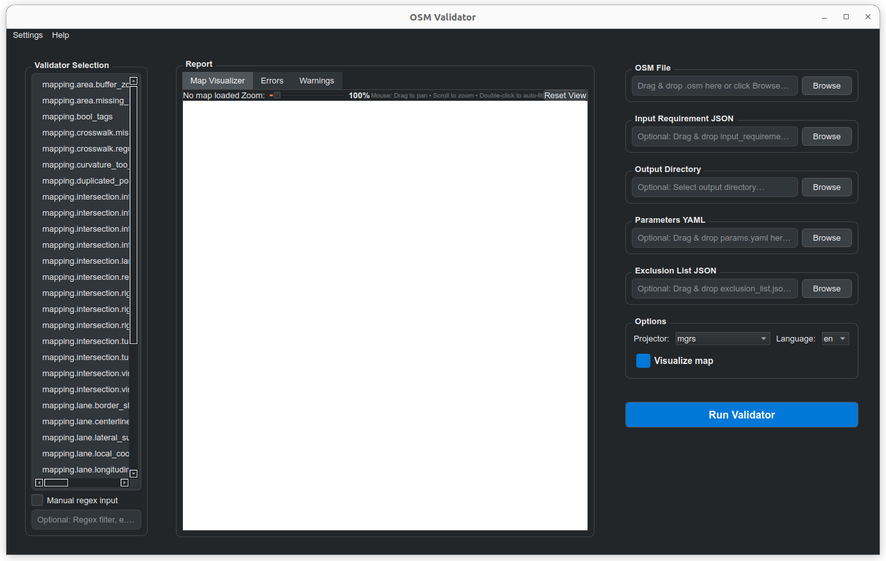

# autoware_lanelet2_map_validator

🇬🇧 [English ver](./README.md) | 🇯🇵 **日本語 ver**

**本パッケージは元々 `autowarefoundation/autoware_tools` の一パッケージでしたが、2025年2月より本リポジトリに移動しました。2025年2月以前のコミットは `autowarefoundation/autoware_tools` にて行われたものです。**

`autoware_lanelet2_map_validator` は Lanelet2 地図が Autoware 上で正しく機能するかを自動検証するツールです。

Autoware が求める Lanelet2 地図の要求は [Vector Map creation requirement specifications (in Autoware Documentation)](https://autowarefoundation.github.io/autoware-documentation/main/design/autoware-architecture/map/map-requirements/vector-map-requirements-overview/) もしくは [Pilot-Auto reference design](https://docs.pilot.auto/reference-design/common/map-requirements/vector-map-requirements/overview) に掲載されています。（両者に少し違いがあるのでご注意ください。）

## 目次

- [構成](#構成)
- [インストール方法](#インストール方法)
- [使い方](#使い方)
  - [使用方法A: 要求仕様リストを用いた検証](#使用方法a-要求仕様リストを用いた検証)
  - [使用方法B: 検証器を指定した検証](#使用方法b-検証器を指定した検証)
  - [使用方法C: GUI アプリケーションを用いた検証](#使用方法c-gui-アプリケーションを用いた検証)
  - [その他応用例](#その他応用例)
  - [オプション一覧](#オプション一覧)
- [入出力](#入出力)
  - [要求仕様リスト (入力 JSON ファイル、推奨)](#要求仕様リスト-入力-json-ファイル推奨)
  - [検証結果ファイル (出力 JSON ファイル)](#検証結果ファイル-出力-json-ファイル)
  - [除外リスト（入力 JSON ファイル、任意）](#除外リスト-入力-json-ファイル任意)
  - [検証内容の印字](#検証内容の印字)
- [新しい検証器を作成する場合](#新しい検証器を作成する場合)
- [各要求仕様と検証器の対応表](#各要求仕様と検証器の対応表)

## 構成

`autoware_lanelet2_map_validator` は [lanelet2_validation](https://github.com/fzi-forschungszentrum-informatik/Lanelet2/tree/master/lanelet2_validation) パッケージを拡張して実装された `.osm` ファイル検証ツールです。

本ツールは Lanelet2 地図 (`.osm` 形式ファイル)と要求仕様 (`.json` 形式、任意)を入力とし、検証結果をコンソール出力および `.json` 形式で出力します。

要求仕様が入力されると、`autoware_lanelet2_map_validator` は入力内容を反映した出力ファイルを出力します。


## インストール方法

**現在 `autoware_lanelet2_map_validator` は [Autoware](https://github.com/autowarefoundation/autoware) と同じワークスペースでビルドされる必要があります。**
将来的には `autoware_lanelet2_map_validator` 単体でインストールできるようにしたいと考えています。

### 0. 動作条件

以下の動作環境を用意してください。

- OS
  - Ubuntu 22.04
- ROS
  - ROS 2 Humble
- Git

### 1. Autoware をクローン (まだ Autoware 環境を持っていない場合)

ターミナルを起動し、以下のコマンドで　Autoware をインストールします。

```bash
git clone https://github.com/autowarefoundation/autoware.git
cd autoware
mkdir src
vcs import src < autoware.repos
```

### 2. autoware_lanelet2_map_validator をクローン

`autoware_lanelet2_map_validator` は `autoware/src` ディレクトリ内に配置してください。
ディレクトリ構成に特に制約がない場合は以下のコマンドで十分です。
バージョン指定が必要ない場合は `git checkout` は不要です。

```bash
# Assuming you are at the `autoware` directory
cd src
git clone https://github.com/tier4/autoware_lanelet2_map_validator.git
git checkout <VERSION>  # 1.0.0 for example
cd ..  # go back to the `autoware` directory
```

### 3. 必要パッケージをインストール

`Autoware` に必要なパッケージをインストールします。

```bash
# Assuming you are at the `autoware` directory
source /opt/ros/humble/setup.bash
sudo apt update && sudo apt upgrade
rosdep update
rosdep install -y --from-paths src --ignore-src --rosdistro $ROS_DISTRO
```

### 4. autoware_lanelet2_map_validator をビルド

以下のコマンドで `autoware_lanelet2_map_validator` をビルドします。`--packages-up-to autoware_lanelet2_map_validator` と指定することで `Autoware` 全体をビルドせずに済みます。

```bash
colcon build --symlink-install --cmake-args -DCMAKE_BUILD_TYPE=Release --packages-up-to autoware_lanelet2_map_validator
```

## 使い方

`autoware_lanelet2_map_validator` の使い方は「要求仕様リストを用いた検証」と「検証器を指定した検証」の2通りがあります。
基本的には要求仕様リストを使って使用することをおすすめします。

### 使用方法A: 要求仕様リストを用いた検証

以下のコマンドで `autoware_lanelet2_map_validator` を実行します。

```bash
# Assuming you are at the `autoware` directory
source install/setup.bash

ros2 run autoware_lanelet2_map_validator autoware_lanelet2_map_validator \
--projector mgrs \ # or -p in short
--map_file <absolute_or/relative_path/to_your/lanelet2_map.osm> \ # or -m in short
--input_requirements <absolute_or/_relative_path/to_your/requirement_set.json> \ # or -i in short
--output_directory <directory/where_you/want_to/save_results> \ # or -o in short
```

例えば以下のような場合

- 地図が MGRS 投影法で構成されている
- 地図は `$HOME/autoware_map/area1/lanelet2_map.osm` として保存されている
- 要求仕様リストとして `autoware_requirement_set.json` を指定している
- 現在のディレクトリに検証結果ファイル (`lanelet2_validation_results.json`) を出力する

コマンド例は以下の通りになります。

```bash
# Assuming you are at the `autoware` directory
source install/setup.bash

ros2 run autoware_lanelet2_map_validator autoware_lanelet2_map_validator \
-p mgrs \
-m $HOME/autoware_map/area1/lanelet2_map.osm \
-i ./install/autoware_lanelet2_map_validator/share/autoware_lanelet2_map_validator/map_requirements/autoware_requirement_set.json
-o ./
```

実行後、検証結果ファイル (`lanelet2_validation_results.json`)が現在のディレクトリ下にあることが確認できます。要求仕様リストと出力ファイル（`lanelet2_validation_results.json`）の詳細については[入出力](#入出力)を参照してください。

**また、以下の点に注意してください。**

- 検証目的と合致した要求仕様リストを `autoware_lanelet2_map_validator/map_requirements` ディレクトリから探してください。
  - 特に指定の要求仕様リストがなければ Autoware の地図仕様に即した `autoware_lanelet2_map_validator` を使ってください。
- `lanelet2_validation_results.json` が既に存在する場合は上書きされてしまいます。
- 下記のようなタブが Lanelet2 地図 (`osm` ファイル) に追記されます。このタブは Autoware の挙動に影響はしません。
  - 本タブの情報は自動的に付与されるもので、何か手入力する必要はありません。`validation_version` は `package.xml` から、`requirements_version` は要求仕様リストから取得されます。

  ```xml
  <validation name="autoware_lanelet2_map_validator" validator_version="1.0.0" requirements="autoware_requirement_set.json" requirements_version="0.0.0" />
  ```

### 使用方法B: 検証器を指定した検証

`autoware_lanelet2_map_validator` は小さな検証器から構成されています。
もしも個別の検証器に対して検証を行いたい場合は `--validator, -v` オプションを用いることができます。

```bash
ros2 run autoware_lanelet2_map_validator autoware_lanelet2_map_validator \
--projector mgrs \ # or -p in short
--map_file path/to_your/lanelet2_map.osm  \ # or -m in short
--validator mapping.traffic_light.missing_regulatory_elements \ # or -v in short
```

利用可能な検証器は `--print` オプションで確認できるほか、[各要求仕様と検証器の対応表](#各要求仕様と検証器の対応表)でも確認することができます。

```bash
ros2 run autoware_lanelet2_map_validator autoware_lanelet2_map_validator --print
```

**また、以下の点に注意してください。**

- この使用方法では、`--output_directory` で指定しても `lanelet2_validation_results.json` は出力されません。
- 複数の検証機を指定する場合はコンマ区切りの文字列 (例：`"mapping.traffic_light.correct_facing,mapping.traffic_light.missing_regulatory_elements"`) か、正規表現 (例：`mapping.traffic_light.*`) を用いて指定してください。

### 使用方法C: GUI アプリケーションを用いた検証

autoware_lanelet2_map_validator には GUI アプリケーションもございます。
画面右側のオプションの説明は [使用方法A: 要求仕様リストを用いた検証](#使用方法a-要求仕様リストを用いた検証) を参照してください。



### その他応用例

#### 除外リスト

`autoware_lanelet2_map_validator`は「除外リスト」を一緒に入力することで、どの地図要素を検証対象としないかを指定することができます。
除外リストは `--exclusion_list` もしくは `-x` オプションで渡すことができます（下のコマンド例参照）。
上記で説明された両使用方法に対して適用することが可能です。
除外リストの詳細な説明は[除外リスト](#除外リスト-入力-json-ファイル任意)を参照してください。

```bash
ros2 run autoware_lanelet2_map_validator autoware_lanelet2_map_validator \
-p mgrs \
-m $HOME/autoware_map/area1/lanelet2_map.osm \
-i ./install/autoware_lanelet2_map_validator/share/autoware_lanelet2_map_validator/autoware_requirement_set.json
-o ./
-x ./my_exclusion_list.json
```

#### パラメータ

もしも使用する検証器がパラメータを持つ場合は、[autoware_lanelet2_map_validator/config/params.yaml](./autoware_lanelet2_map_validator/config/params.yaml)で変更することができます。
全ての検証器がパラメータを持っているわけではないので、各検証器のドキュメント [autoware_lanelet2_map_validator/docs](./autoware_lanelet2_map_validator/docs/) を参照して、パラメータがあるか、そしてそれがどのようなパラメータであるかを確認してください。

### オプション一覧

| オプション                 | 説明                                                                                                                                       |
| -------------------------- | ------------------------------------------------------------------------------------------------------------------------------------------ |
| `-h, --help`               | 本ツールおよび使用可能なオプションを説明する。                                                                                             |
| `--print`                  | 使用可能な検証器をリストアップする                                                                                                         |
| `-m, --map_file`           | 検証する Lanelet2 地図のファイルパス                                                                                                       |
| `-i, --input_requirements` | JSON 形式の要求仕様リストのファイルパス                                                                                                    |
| `-o, --output_directory`   | JSON 形式の検証結果の保存ディレクトリ                                                                                                      |
| `-x, --exclusion_list`     | JSON 形式の除外リストのファイルパス                                                                                                        |
| `-v, --validator`          | カンマ区切りおよび正規表現で与えられた検証器のみを実行する。例えば、 `mapping.*` と指定すると `mapping` から始まる全ての検証器を実行する。 |
| `-p, --projector`          | Lanelet2 地図の投影法。　`mgrs`, `utm`, `transverse_mercator` から選択。                                                                   |
| `--parameters`             | パラメータを格納する YAML ファイルのパス。指定されなければデフォルトで `config/params.yaml` を用いる。                                     |
| `-l, --language`           | 出力されるイシューメッセージの言語（"en" or "ja"）。指定されなければデフォルトで "en" になる。                                             |
| `--location`               | 地図の場所に関する情報 (未使用)                                                                                                            |
| `--participants`           | 自動車や歩行者など交通ルールの対象の指定 (未使用)                                                                                          |
| `--lat`                    | 地図原点の緯度。 これは transverse mercator 投影法や utm 投影法で用いる。                                                                  |
| `--lon`                    | 地図原点の軽度。 これは transverse mercator 投影法や utm 投影法で用いる。                                                                  |

## 入出力

本節では `autoware_lanelet2_map_validator` の入出力の詳細を解説します。

### 要求仕様リスト (入力 JSON ファイル、推奨)

本ツールに入力される JSON ファイルを以下のような構成をしています。

```json
{
  "requirements": [
    {
      "id": "vm-02-02",
      "validators": [
        {
          "name": "mapping.stop_line.missing_regulatory_elements"
        }
      ]
    },
    {
      "id": "vm-04-01",
      "validators": [
        {
          "name": "mapping.crosswalk.missing_regulatory_elements"
        },
        {
          "name": "mapping.crosswalk.regulatory_element_details",
          "prerequisites": [
            {
              "name": "mapping.crosswalk.missing_regulatory_elements"
            }
          ]
        }
      ]
    },
    {
      "id": "vm-05-01",
      "validators": [
        {
          "name": "mapping.traffic_light.missing_regulatory_elements"
        },
        {
          "name": "mapping.traffic_light.regulatory_element_details",
          "prerequisites": [
            {
              "name": "mapping.traffic_light.missing_regulatory_elements"
            }
          ]
        }
      ]
    }
  ]
}
```

- 必ず一つの `requirements` フィールドを持つこと
- `requirements` フィールドは要求仕様のリストの形で構成されること。要求仕様は必ず以下を持つ。
  - `id`: 要求仕様の ID。ID 名は任意。
  - `validators`: 本要求仕様を検証する検証器のリスト。
    - 検証器は `name` フィールドに検証器名を入力することで指定する。
    - 検証器名は `--print` オプションで表示されるものである。
    - 各検証器には前提条件を `prerequisites` として与えることができる。前提条件が設定された場合、前提条件で指定された検証器がパスしたときに限り検証を実行し、イシューが検出された場合は検証は実行されない。
    - さらに `prerequisites` フィールド内に `forgive_warnings: true` と指定することで、WARNING レベルのイシューでは検証はスキップされなくなる。（ERROR レベルのイシューがあった場合はスキップされる。）`forgive_warnings` を記載しないことは `forgive_warnings: false` と記載することと同義であり、ERROR レベルのイシューでも WARNING レベルのイシューでも対応する検証器は実行されない。
- `requirements` 外については自由に情報を付与できる。

### 検証結果ファイル (出力 JSON ファイル)

`--input_requirements` オプションで要求仕様リストが入力されたとき、検証結果が追記された新たな JSON ファイル `lanelet2_validation_results.json` が出力されます。検知された仕様違反は「イシュー」と呼ばれる形で出力されます。

```json
{
  "requirements": [
    {
      "id": "vm-02-02",
      "passed": true,
      "validators": [
        {
          "name": "mapping.stop_line.missing_regulatory_elements",
          "passed": true
        }
      ]
    },
    {
      "id": "vm-04-01",
      "passed": false,
      "validators": [
        {
          "issues": [
            {
              "id": 163,
              "issue_code": "Crosswalk.MissingRegulatoryElements-001",
              "message": "No regulatory element refers to this crosswalk.",
              "primitive": "lanelet",
              "severity": "Error"
            },
            {
              "id": 164,
              "issue_code": "Crosswalk.MissingRegulatoryElements-001",
              "message": "No regulatory element refers to this crosswalk.",
              "primitive": "lanelet",
              "severity": "Error"
            },
            {
              "id": 165,
              "issue_code": "Crosswalk.MissingRegulatoryElements-001",
              "message": "No regulatory element refers to this crosswalk.",
              "primitive": "lanelet",
              "severity": "Error"
            },
            {
              "id": 166,
              "issue_code": "Crosswalk.MissingRegulatoryElements-001",
              "message": "No regulatory element refers to this crosswalk.",
              "primitive": "lanelet",
              "severity": "Error"
            }
          ],
          "name": "mapping.crosswalk.missing_regulatory_elements",
          "passed": false
        },
        {
          "issues": [
            {
              "id": 0,
              "issue_code": "General.PrerequisitesFailure-001",
              "message": "Prerequisites didn't pass",
              "primitive": "primitive",
              "severity": "Error"
            }
          ],
          "name": "mapping.crosswalk.regulatory_element_details",
          "passed": false,
          "prerequisites": [
            {
              "name": "mapping.crosswalk.missing_regulatory_elements"
            }
          ]
        }
      ]
    },
    {
      "id": "vm-05-01",
      "passed": false,
      "validators": [
        {
          "name": "mapping.traffic_light.missing_regulatory_elements",
          "passed": true
        },
        {
          "issues": [
            {
              "id": 9896,
              "issue_code": "TrafficLight.MissingRegulatoryElements-001",
              "message": "Regulatory element of traffic light must have a stop line(ref_line).",
              "primitive": "regulatory element",
              "severity": "Error"
            },
            {
              "id": 9918,
              "issue_code": "TrafficLight.MissingRegulatoryElements-001",
              "message": "Regulatory element of traffic light must have a stop line(ref_line).",
              "primitive": "regulatory element",
              "severity": "Error"
            },
            {
              "id": 9838,
              "issue_code": "TrafficLight.MissingRegulatoryElements-001",
              "message": "Regulatory element of traffic light must have a stop line(ref_line).",
              "primitive": "regulatory element",
              "severity": "Error"
            },
            {
              "id": 9874,
              "issue_code": "TrafficLight.MissingRegulatoryElements-001",
              "message": "Regulatory element of traffic light must have a stop line(ref_line).",
              "primitive": "regulatory element",
              "severity": "Error"
            }
          ],
          "name": "mapping.traffic_light.regulatory_element_details",
          "passed": false,
          "prerequisites": [
            {
              "name": "mapping.traffic_light.missing_regulatory_elements"
            }
          ]
        }
      ]
    }
  ]
}
```

- `lanelet2_validation_results.json` は `--input_requirements` で渡された入力ファイルの内容を引き継ぎ、それに検証結果を追記した新規 JSON ファイルを出力する。
  - `requirements` 外の内容もそのままコピーされます。
- 各要求仕様オブジェクトに対して、`passed` フィールドが追加されます。 要求仕様を検証する全検証器がパスした場合は `true` に、何か一つでも ERROR, WARNING 相当のイシューが検知された場合は `false` になります。
- 各検証器についても `passed` フィールドが追加されます。検証器が何か一つでも ERROR, WARNING 相当のイシューが検知された場合は `false` になり、見つからなかった場合は `true` になります。各イシューは `severity`, `primitive`, `id`, `message` and `issue_code` から構成されます。
  - `severity` は検知されたイシューの重大性を表現しています (Error, Warning, info)。ただし、各 severity レベルの定義はなく、実装者の判断に任されています。
  - `primitive` は Lanelet2 地図のどの要素における仕様違反であるかを示しています。(Lanelet, Linestring, Regulatory Element, etc...)
  - `id` は上記 primitive の ID を指しています。
  - `message` は具体的なイシューの内容を記しています。
  - `issue_code` 上記 `message` に紐付けられるエラーコードのようなもので、他ツールとの接続を意識して設けられています（現状未使用）。一般用途では確認する必要はありません。

### 除外リスト (入力 JSON ファイル、任意)

もしも仕様を違反しているがどうしても修正することができない地図要素がある場合は、その地図要素だけを検証対象から外すことができます。
ユーザーは「除外リスト」を作成することで `autoware_lanelet2_map_validator` がどの地図要素を無視するかを指定することができます。
`sample_exclusion_list.json` に書かれている通り、除外リストは以下のような構造を持ちます。

```json
{
  "exclusion": [
    {
      "primitive": "lanelet",
      "id": 123
    },
    {
      "primitive": "linestring",
      "id": 9876,
      "validators": [
        {
          "name": "mapping.traffic_light.missing_regulatory_elements"
        },
        {
          "name": "mapping.traffic_light.regulatory_element_details"
        }
      ]
    }
  ]
}
```

- 必ず一つの `exclusion` フィールドを持つこと
- `exclusion` フィールドは primitive (地図要素) のリストの形で構成されること。primitive は必ず以下を持つ。
  - `primitive`: primitive のタイプ。`point`, `linestring`, `polygon`, `lanelet`, `area`, `regulatory element`, `primitive` のいずれかである。
  - `id`: primitive の ID。
- 必要があれば `primitive` に `validators` フィールドを追加することができる。これによって、`validators` で指定された検証器に対してのみ検証対象から除外される。
  - `validators` は検証器名のリストとして構成されること。`validators` に直接検証器名を書いてはならない。
  - **もし `validators` フィールドが書かれていない場合、その primitive は全ての検証器において無視される。**
  - 上記を例に取ると、Lanelet 123 は全ての検証工程から除外され、Linestring 9876 は検証器 "mapping.traffic_light.missing_regulatory_elements" と "mapping.traffic_light.regulatory_element_details" の検証においてのみ無視される。
- 除外リストにはユーザー都合で `exclusion` 以外のフィールドを追記しても良い。

### 検証内容の印字

`--input-requirements` で JSON ファイルが入力されたとき、`autoware_lanelet2_map_validator` は以下の内容を Lanelet2 地図 (osm ファイル)に追記します。

- 本ツール名 (常に `autoware_lanelet2_map_validator`)
- 本ツールのバージョン (The version of the `autoware_lanelet2_map_validator`)
- 入力された JSON ファイル名
- 入力された JSON ファイルのバージョン。（存在しない場合は空欄）

これらの情報は `validation` タブとして追記されます。

```xml
<validation name="autoware_lanelet2_map_validator" validator_version="1.0.0" requirements="autoware_requirement_set.json" requirements_version="0.0.0" />
```

## 新しい検証器を作成する場合

`autoware_lanelet2_map_validator` に新しく検証器を実装したい場合は [how_to_contribute](./autoware_lanelet2_map_validator/docs/how_to_contribute.md) (英語版のみ)を参照してください。

## 各要求仕様と検証器の対応表

下表は Autoware Documentation の [Vector Map creation requirement specifications (in Autoware Documentation)](https://autowarefoundation.github.io/autoware-documentation/main/design/autoware-architecture/map/map-requirements/vector-map-requirements-overview/) に書かれている各要求仕様に対応する検証器の対応表になります。
"Validators" が空欄である項目は未実装・未対応であることを意味します。
本表は [Pilot-Auto reference design](https://docs.pilot.auto/reference-design/common/map-requirements/vector-map-requirements/overview) をベースに作られています。

| ID       | Requirements                                                             | Validators                                                                                                                                                                                                                                                                                                                                                                                                                                                      |
| -------- | ------------------------------------------------------------------------ | --------------------------------------------------------------------------------------------------------------------------------------------------------------------------------------------------------------------------------------------------------------------------------------------------------------------------------------------------------------------------------------------------------------------------------------------------------------- |
| vm-01-01 | Lanelet basics                                                           | [mapping.lane.road_lanelet_attribute](./autoware_lanelet2_map_validator/docs/lane/road_lanelet_attribute.md)                                                                                                                                                                                                                                                                                                                                                    |
| vm-01-02 | Allowance for lane changes                                               | [mapping.lane.lane_change_attribute](./autoware_lanelet2_map_validator/docs/lane/lane_change_attribute.md)                                                                                                                                                                                                                                                                                                                                                      |
| vm-01-03 | Linestring sharing                                                       | [mapping.lane.border_sharing](./autoware_lanelet2_map_validator/docs/lane/border_sharing.md)                                                                                                                                                                                                                                                                                                                                                                    |
| vm-01-04 | Sharing of the centerline of lanes for opposing traffic                  | [mapping.lane.border_sharing](./autoware_lanelet2_map_validator/docs/lane/border_sharing.md)                                                                                                                                                                                                                                                                                                                                                                    |
| vm-01-05 | Lane geometry                                                            |                                                                                                                                                                                                                                                                                                                                                                                                                                                                 |
| vm-01-06 | Line position (1)                                                        | (Not possible to validate because real-world correspondence cannot be determined programmatically.)                                                                                                                                                                                                                                                                                                                                                             |
| vm-01-07 | Line position (2)                                                        | (Not possible to validate because real-world correspondence cannot be determined programmatically.)                                                                                                                                                                                                                                                                                                                                                             |
| vm-01-08 | Line position (3)                                                        | (Not possible to validate because real-world correspondence cannot be determined programmatically.)                                                                                                                                                                                                                                                                                                                                                             |
| vm-01-09 | Speed limits                                                             | [mapping.lane.speed_limit_validity](./autoware_lanelet2_map_validator/docs/lane/speed_limit_validity.md)                                                                                                                                                                                                                                                                                                                                                        |
| vm-01-10 | Centerline                                                               | [mapping.lane.centerline_geometry](./autoware_lanelet2_map_validator/docs/lane/centerline_geometry.md)                                                                                                                                                                                                                                                                                                                                                          |
| vm-01-11 | Centerline connection (1)                                                |                                                                                                                                                                                                                                                                                                                                                                                                                                                                 |
| vm-01-12 | Centerline connection (2)                                                |                                                                                                                                                                                                                                                                                                                                                                                                                                                                 |
| vm-01-13 | Roads with no centerline (1)                                             |                                                                                                                                                                                                                                                                                                                                                                                                                                                                 |
| vm-01-14 | Roads with no centerline (2)                                             |                                                                                                                                                                                                                                                                                                                                                                                                                                                                 |
| vm-01-15 | Road shoulder                                                            | [mapping.lane.road_shoulder](./autoware_lanelet2_map_validator/docs/lane/road_shoulder.md)                                                                                                                                                                                                                                                                                                                                                                      |
| vm-01-16 | Road shoulder Linestring sharing                                         |                                                                                                                                                                                                                                                                                                                                                                                                                                                                 |
| vm-01-17 | Side strip                                                               | [mapping.lane.pedestrian_lane](./autoware_lanelet2_map_validator/docs/lane/pedestrian_lane.md)                                                                                                                                                                                                                                                                                                                                                                  |
| vm-01-18 | Side strip Linestring sharing                                            |                                                                                                                                                                                                                                                                                                                                                                                                                                                                 |
| vm-01-19 | Walkway                                                                  |                                                                                                                                                                                                                                                                                                                                                                                                                                                                 |
| vm-01-20 | Linestring sharing between two Lanelets                                  | [mapping.lane.centerline_geometry](./autoware_lanelet2_map_validator/docs/lane/lateral_subtype_connection.md)                                                                                                                                                                                                                                                                                                                                                   |
| vm-01-21 | Front and rear connections between Lanelets                              | [mapping.lane.longitudinal_subtype_connection](./autoware_lanelet2_map_validator/docs/lane/longitudinal_subtype_connection.md)                                                                                                                                                                                                                                                                                                                                  |
| vm-02-01 | Stop line alignment                                                      | (Not possible to validate because real-world correspondence cannot be determined programmatically.)                                                                                                                                                                                                                                                                                                                                                             |
| vm-02-02 | Stop sign                                                                | [mapping.stop_line.missing_regulatory_elements](./autoware_lanelet2_map_validator/docs/stop_line/missing_regulatory_elements_for_stop_lines.md)                                                                                                                                                                                                                                                                                                                 |
| vm-02-03 | Double stop lines                                                        | (Not possible to validate because real-world correspondence cannot be determined programmatically.)                                                                                                                                                                                                                                                                                                                                                             |
| vm-02-04 | Stop line supplements                                                    |                                                                                                                                                                                                                                                                                                                                                                                                                                                                 |
| vm-03-01 | Intersection criteria                                                    | [mapping.intersection.intersection_area_dangling_reference](./autoware_lanelet2_map_validator/docs/intersection/intersection_area_dangling_reference.md), [mapping.intersection.intersection_area_tagging](./autoware_lanelet2_map_validator/docs/intersection/intersection_area_tagging.md)                                                                                                                                                                    |
| vm-03-02 | Lanelet's turn direction and virtual                                     | [mapping.intersection.turn_direction_tagging](./autoware_lanelet2_map_validator/docs/intersection/turn_direction_tagging.md), [mapping.intersection.lanelet_border_type](./autoware_lanelet2_map_validator/docs/intersection/intersection_lanelet_border_type.md)                                                                                                                                                                                               |
| vm-03-03 | Lanelet width in the intersection                                        |                                                                                                                                                                                                                                                                                                                                                                                                                                                                 |
| vm-03-04 | Lanelet creation in the intersection                                     |                                                                                                                                                                                                                                                                                                                                                                                                                                                                 |
| vm-03-05 | Lanelet division in the intersection                                     | [mapping.intersection.lanelet_division](./autoware_lanelet2_map_validator/docs/intersection/lanelet_division.md)                                                                                                                                                                                                                                                                                                                                                |
| vm-03-06 | Guide lines in the intersection                                          |                                                                                                                                                                                                                                                                                                                                                                                                                                                                 |
| vm-03-07 | Multiple lanelets in the intersection                                    |                                                                                                                                                                                                                                                                                                                                                                                                                                                                 |
| vm-03-08 | Intersection Area range                                                  | [mapping.intersection.intersection_area_validity](./autoware_lanelet2_map_validator/docs/intersection/intersection_area_validity.md), [mapping.intersection.intersection_area_segment_type](./autoware_lanelet2_map_validator/docs/intersection/intersection_area_segment_type.md)                                                                                                                                                                              |
| vm-03-09 | Range of Lanelet in the intersection                                     |                                                                                                                                                                                                                                                                                                                                                                                                                                                                 |
| vm-03-10 | Right of way (with signal)                                               | [mapping.intersection.right_of_way_with_traffic_lights](./autoware_lanelet2_map_validator/docs/intersection/right_of_way_with_traffic_lights.md)                                                                                                                                                                                                                                                                                                                |
| vm-03-11 | Right of way (without signal)                                            | [mapping.intersection.right_of_way_without_traffic_lights](./autoware_lanelet2_map_validator/docs/intersection/right_of_way_without_traffic_lights.md)                                                                                                                                                                                                                                                                                                          |
| vm-03-12 | Right of way supplements                                                 | (Nothing to validate.)                                                                                                                                                                                                                                                                                                                                                                                                                                          |
| vm-03-13 | Merging from private area, sidewalk                                      |                                                                                                                                                                                                                                                                                                                                                                                                                                                                 |
| vm-03-14 | Road marking                                                             |                                                                                                                                                                                                                                                                                                                                                                                                                                                                 |
| vm-03-15 | Exclusive bicycle lane                                                   |                                                                                                                                                                                                                                                                                                                                                                                                                                                                 |
| vm-03-16 | Virtual Traffic Light for Intersection Coordination                      | [mapping.intersection.regulatory_element_details_for_virtual_traffic_lights](./autoware_lanelet2_map_validator/docs/intersection/regulatory_element_details_for_virtual_traffic_lights.md), [mapping.intersection.virtual_traffic_light_line_order](./autoware_lanelet2_map_validator/docs/intersection/virtual_traffic_light_line_order.md)                                                                                                                    |
| vm-03-17 | Virtual Traffic Light's right_of_way for Intersection Coordination       | [mapping.intersection.right_of_way_for_virtual_traffic_lights](./autoware_lanelet2_map_validator/docs/intersection/right_of_way_for_virtual_traffic_lights.md)                                                                                                                                                                                                                                                                                                  |
| vm-03-18 | Restrictions for the Virtual Traffic Light for Intersection Coordination | [mapping.intersection.virtual_traffic_light_section_overlap](./autoware_lanelet2_map_validator/docs/intersection/virtual_traffic_light_section_overlap.md)                                                                                                                                                                                                                                                                                                      |
| vm-04-01 | Traffic light basics                                                     | [mapping.traffic_light.missing_regulatory_elements](./autoware_lanelet2_map_validator/docs/traffic_light/missing_regulatory_elements_for_traffic_lights.md), [mapping.traffic_light.regulatory_element_details](./autoware_lanelet2_map_validator/docs/traffic_light/regulatory_element_details_for_traffic_lights.md), [mapping.traffic_light.missing_referrers](./autoware_lanelet2_map_validator/docs/traffic_light/missing_referrers_for_traffic_lights.md) |
| vm-04-02 | Traffic light position and size                                          | [mapping.traffic_light.correct_facing](./autoware_lanelet2_map_validator/docs/traffic_light/traffic_light_facing.md), [mapping.traffic_light.body_height](./autoware_lanelet2_map_validator/docs/traffic_light/body_height.md)                                                                                                                                                                                                                                  |
| vm-04-03 | Traffic light lamps                                                      |                                                                                                                                                                                                                                                                                                                                                                                                                                                                 |
| vm-05-01 | Crosswalks across the road                                               | [mapping.crosswalk.missing_regulatory_elements](./autoware_lanelet2_map_validator/docs/crosswalk/missing_regulatory_elements_for_crosswalk.md), [mapping.crosswalk.regulatory_element_details](./autoware_lanelet2_map_validator/docs/crosswalk/regulatory_element_details_for_crosswalks.md) (TODO: handle cases against missing referrers)                                                                                                                    |
| vm-05-02 | Crosswalks with pedestrian signals                                       |                                                                                                                                                                                                                                                                                                                                                                                                                                                                 |
| vm-05-03 | Deceleration for safety at crosswalks                                    |                                                                                                                                                                                                                                                                                                                                                                                                                                                                 |
| vm-05-04 | Fences                                                                   |                                                                                                                                                                                                                                                                                                                                                                                                                                                                 |
| vm-06-01 | Buffer Zone                                                              | [mapping.area.buffer_zone_validity](./autoware_lanelet2_map_validator/docs/area/buffer_zone_validity.md)                                                                                                                                                                                                                                                                                                                                                        |
| vm-06-02 | No parking signs                                                         | [mapping.area.no_parking_area](./autoware_lanelet2_map_validator/docs/area/no_parking_area.md)                                                                                                                                                                                                                                                                                                                                                                  |
| vm-06-03 | No stopping signs                                                        |                                                                                                                                                                                                                                                                                                                                                                                                                                                                 |
| vm-06-04 | No stopping sections                                                     | [mapping.area.no_stopping_area](./autoware_lanelet2_map_validator/docs/area/no_stopping_area.md)                                                                                                                                                                                                                                                                                                                                                                |
| vm-06-05 | Detection area                                                           |                                                                                                                                                                                                                                                                                                                                                                                                                                                                 |
| vm-06-06 | Bus Stop Area                                                            | [mapping.area.missing_regulatory_elements_for_bus_stop_areas](./autoware_lanelet2_map_validator/docs/area/missing_regulatory_elements_for_bus_stop_areas.md)                                                                                                                                                                                                                                                                                                    |
| vm-07-01 | Vector Map creation range                                                | (Not possible to validate because real-world correspondence cannot be determined programmatically?)                                                                                                                                                                                                                                                                                                                                                             |
| vm-07-02 | Range of detecting pedestrians who enter the road                        | (Not possible to validate because real-world correspondence cannot be determined programmatically.)                                                                                                                                                                                                                                                                                                                                                             |
| vm-07-03 | Guardrails, guard pipes, fences                                          | (Not possible to validate because real-world correspondence cannot be determined programmatically.)                                                                                                                                                                                                                                                                                                                                                             |
| vm-07-04 | Bicycle navigation marks/lines                                           |                                                                                                                                                                                                                                                                                                                                                                                                                                                                 |
| vm-07-05 | Ellipsoidal height                                                       | (Not possible to validate because real-world correspondence cannot be determined programmatically?)                                                                                                                                                                                                                                                                                                                                                             |
| vm-07-06 | Intersection and added Lane                                              |                                                                                                                                                                                                                                                                                                                                                                                                                                                                 |
| vm-07-07 | Bus stop                                                                 |                                                                                                                                                                                                                                                                                                                                                                                                                                                                 |
| vm-07-08 | Restrictions on Sections Where Lanes Overlap                             |                                                                                                                                                                                                                                                                                                                                                                                                                                                                 |
